# Laporan Praktikum 3 : Core Components dan Stayling #

## LANGKAH 1 - Import Library & Components 

1. Buka File App.js yang ada di folder projek ptmn2
2. Import Library dan Component yang diperlukan
3. Konfirmasi Bukti

   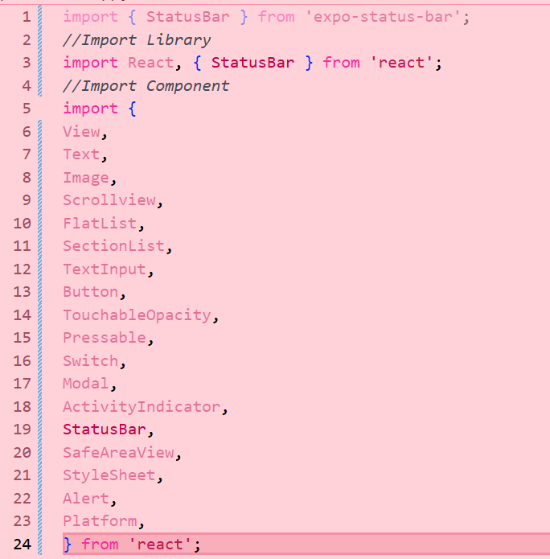

## LANGKAH 2 — Menyiapkan Data (Objek & Array)

1. Membuat Array objek bernama PROFILE untuk menampung Data Profile
2. Konfirmasi Bukti

   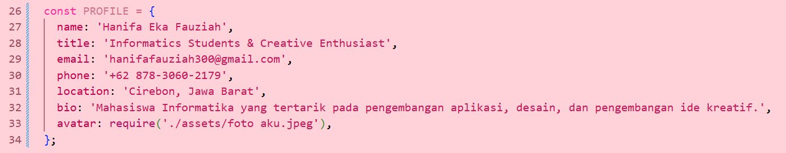

3. Membuat Array Objek bernama SKILLS untuk menampung Data Profile 
4. Konfirmasi Bukti

   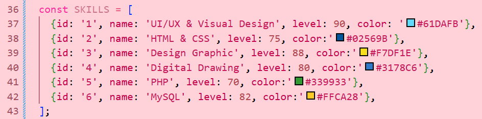 

5. Membuat Array Objek bernama SECTION untuk menampung Data Profile
6. Konfirmasi Bukti

   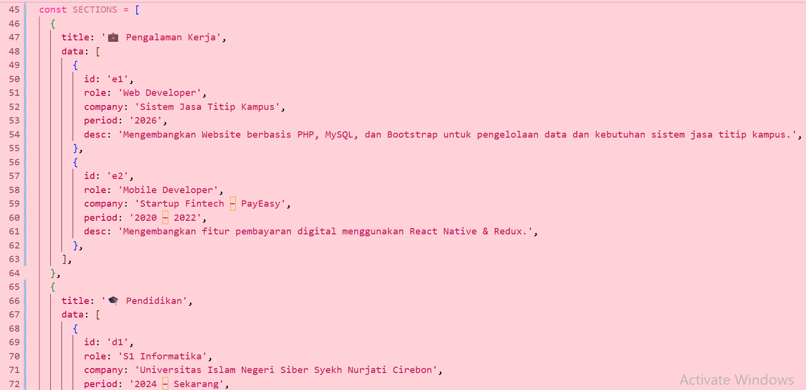 
   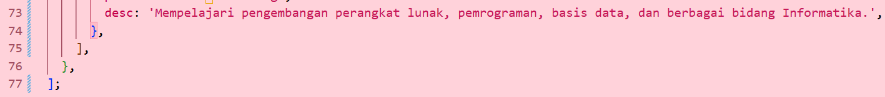

## LANGKAH 3 - Membuat Sub-Components

1. Membuat sub-component SkillCard dan TimelineCard untuk menampilkan data skill serta riwayat pengalaman/pendidikan.
2. Konfirmasi Bukti

   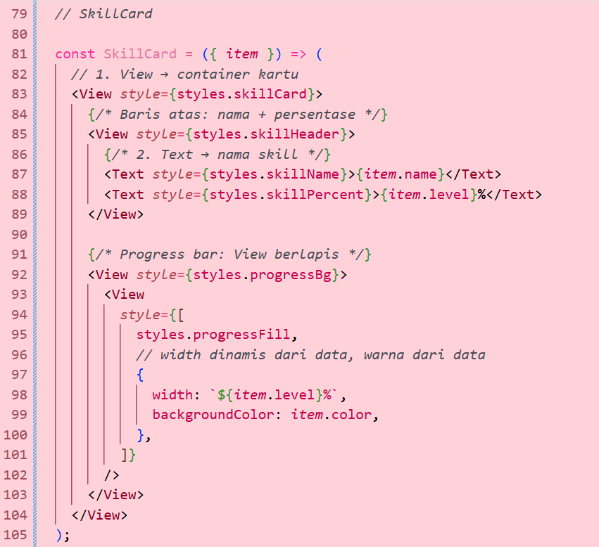
   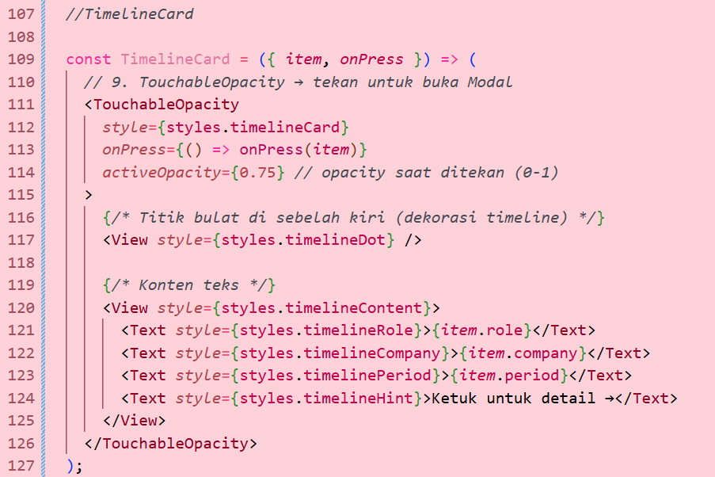

## LANGKAH 4 State Management dengan useState
1. Menmabahkan useState untuk menyimpan data yang dapat berubah pada aplikasi.
2. State digunakan untuk mengatur kondisi seperti Open to Work, from input, loading, dan modal.
3. Setiap perubahan state akan menyebabkan komponen melakukan re-render.
4. Konfirmasi Bukti

   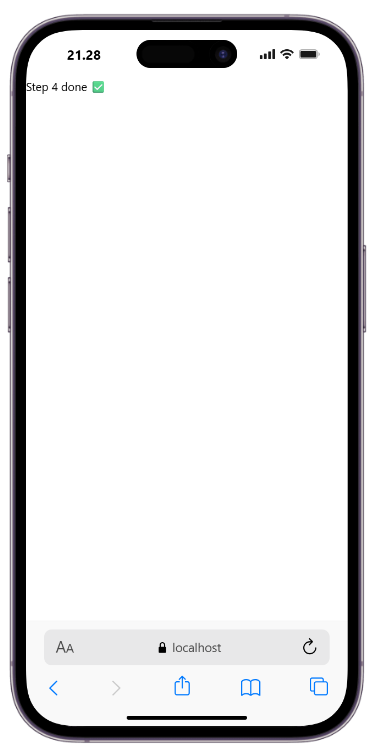

## LANGKAH 5 SafeAreaView, StatusBar & Header
1. Menggunakan SafeAreaView untuk memastikan tampilan aplikasi berada pada area aman perangkat
2. Membuat header menggunakan View dan Switch
3. Switch digunakan untuk mengubah status Open to Work
4. Konfirmasi Bukti
   
   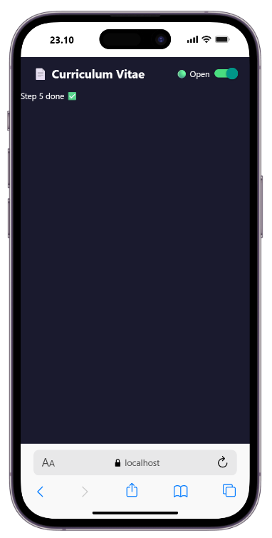

## LANGKAH 6 ScrollView & Profil Section
1. Menggunakan ScrollView untuk membuat seluruh isi CV dapat digulir
2. Menampilkan foto profil menggunakan komponen gambar
3. Menampilkan informasi profil seperti nama, jabatan, dan bio
4. Menambahkan tombol media sosial menggunakan komponen interaksi pengguna.
5. Konfirmasi Bukti

   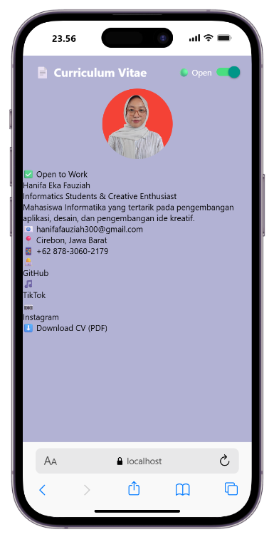 

## LANGKAH 7 FlatList — Daftar Skills
1. Menampilkan data skills menggunakan komponen FlatList
2. FlatList digunakan untuk menampilkan data dalam bentuk daftar secara lebih efisien
3. Data yang ditampilkan berasal dari array objek SKILLS
4. Setiap skill ditampilkan dalam bentuk card yang memiliki progress bar sesuai persentase kemampuan
5. Konfirmasi Bukti

   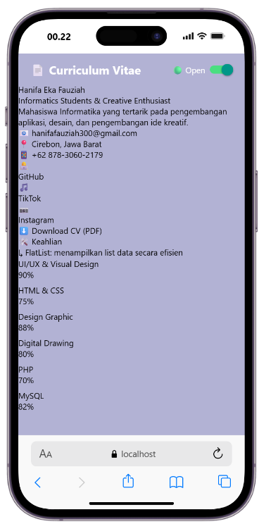 

## LANGKAH 8 SectionList — Pengalaman & Pendidikan
1. Menampilkan data pengalaman dan pendidikan menggunakan SectionList
2. Data dikelompokkan berdasarkan kategori atau section
3. Section digunakan untuk memisahkan bagian pengalaman kerja/organisasi dan riwayat pendidikan
4. Setiap data ditampilkan menggunakan TimelineCard
5. Konfirmasi Bukti

   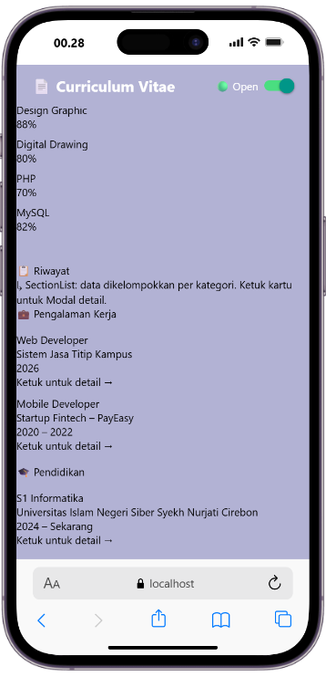 

## LANGKAH 9 TextInput, Button & ActivityIndicator
1. Membuat form kontak menggunakan TextInput untuk menerima input dari pengguna
2. Menggunakan Button sebagai tombol untuk mengirim pesan
3. Menggunakan ActivityIndicator sebagai indikator ketika proses pengiriman sedang berlangsung
4. Input nama dan pesan dikontrol menggunakan state
5. Setelah tombol kirim ditekan, aplikasi menampilkan proses loading kemudian memberikan notifikasi bahwa pesan berhasil dikirim
6. Konfirmasi Bukti

   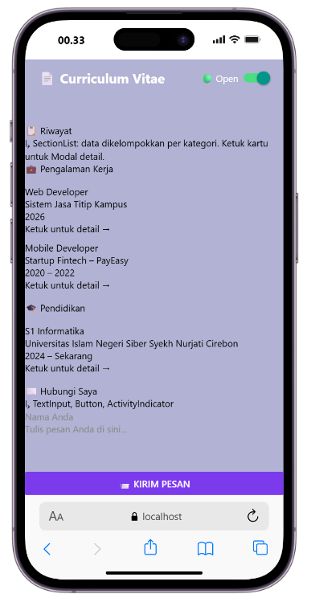
   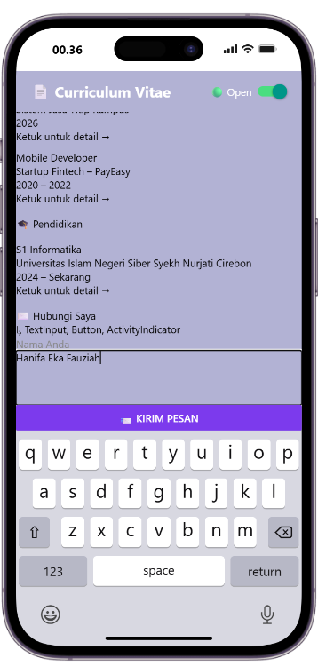

## LANGKAH 10 Modal — Popup Detail
1. Menambahkan komponen Modal untuk menampilkan detail riwayat
2. Modal ditampilkan ketika pengguna menekan kartu riwayat
3. Modal menggunakan animasi slide sehingga muncul dari bagian bawah layar
4. Menambahkan tombol Tutup untuk menutup modal
5. Konfirmasi Bukti

   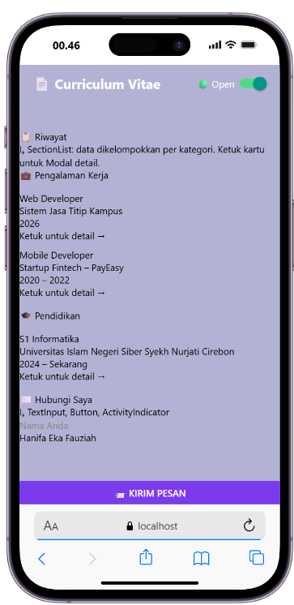

## LANGKAH 11 StyleSheet — Styling Terpusat
1. Membuat konstanta warna untuk mengatur palet warna aplikasi
2. Menggunakan StyleSheet.create() untuk mengatur seluruh tampilan aplikasi secara terpusat
3. Styling diterapkan pada bagian header, profil, sosial media, section, skill card, timeline card, form input, loading, dan modal
4. Penggunaan StyleSheet membuat kode styling lebih terorganisir dan mudah dikelola
5. Konfirmasi Bukti

   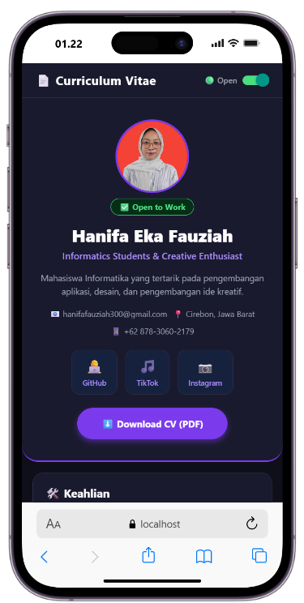

## LANGKAH 12 Verifikasi & Pengujian
1. Menjalankan aplikasi untuk memastikan seluruh komponen dan fitur dapat digunakan dengan baik
2. Melakukan pengujian terhadap tampilan profil, scrolling, switch, daftar skills, riwayat, form kontak, modal, dan tombol sosial media
3. Hasil pengujian disesuaikan dengan fungsi yang telah dibuat pada aplikasi
4. Konfirmasi Bukti

   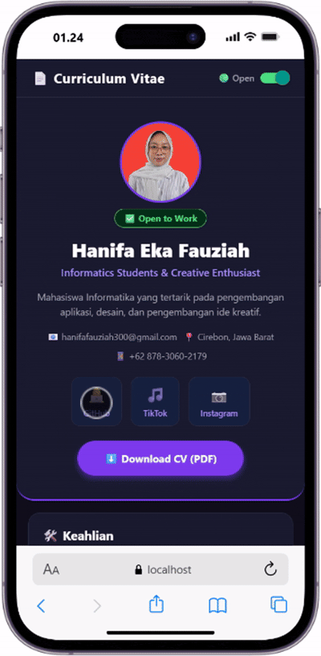